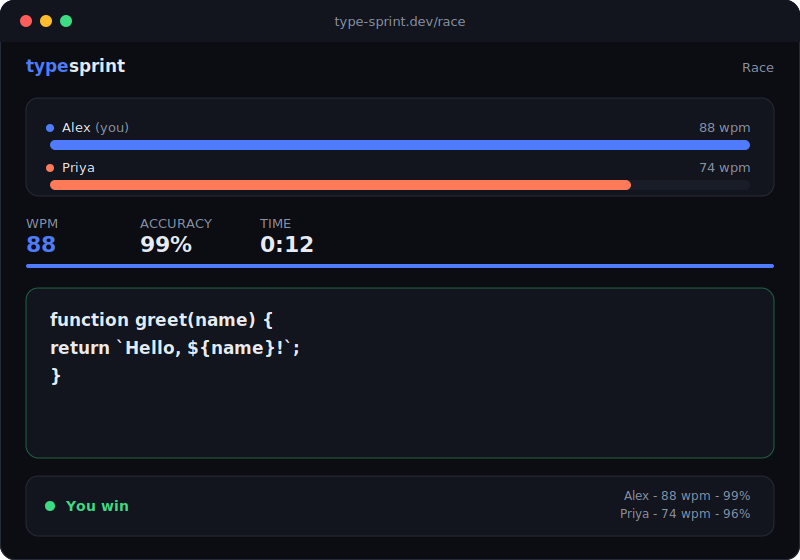

# type-sprint

> A typing speed game for code and prose. Practice solo, take the daily challenge, or race a friend in real time.


<p align="center">
  
</p>

Type at your own pace, take a daily challenge everyone gets the same snippet for, or open a second window and race a friend live. Every keystroke is scored in real time: WPM, accuracy, consistency, and errors, with per-character feedback and a caret that follows exactly where you are.

## Features

- **Solo practice** with difficulty levels and language modes (JavaScript, Python, English prose)
- **Live typing surface**: per-character feedback, a smooth sliding caret, real-time WPM and accuracy
- **Daily challenge**: the same snippet for everyone on a given date, with a local personal best
- **Real-time race**: open a second window, share a 4-letter code, and race over a real WebSocket connection with a live opponent progress bar
- **Personal stats and history**: best/average WPM, accuracy trends, per-language breakdown, stored locally in the browser

## Tech

| Layer | Choice |
| --- | --- |
| Frontend | Next.js (App Router) + Tailwind CSS |
| Components | HeroUI |
| Animation | GSAP for game-feel moments (caret, countdown, race lanes), Motion for simple UI transitions |
| Realtime | Socket.IO (Bun server, `@socket.io/bun-engine`), room-based races |
| Data | No database. Stats and history live in `localStorage`, validated with Zod |
| Testing | Vitest + Testing Library (unit/component), Playwright (e2e), Bun test (server) |

No database and no accounts in this build. Personal stats live in the browser. The "multiplayer" race is a real WebSocket connection with in-memory rooms on a small Bun server, not a mock.

## Running locally

Frontend:

```bash
cd frontend
bun install
bun run dev
```

Race server (only needed for the race mode):

```bash
cd ws-server
bun install
bun run dev
```

Open `http://localhost:3000/race` in two browser windows. Create a race in one, share the 4-letter code, join it in the other, and race.

## Project structure

```
type-sprint/
  frontend/     # Next.js app
  ws-server/    # Bun + Socket.IO race server (in-memory rooms, no DB)
  assets/       # README media
```

## Testing

```bash
# frontend
cd frontend
bun run test        # unit + component (vitest)
bun run test:e2e     # playwright, including a real two-window race
bun run typecheck
bun run lint

# race server
cd ws-server
bun test             # unit + real-socket integration
bun run typecheck
bun run lint
```

## Status

Public portfolio project. No database, no accounts, no deployment config included here.
